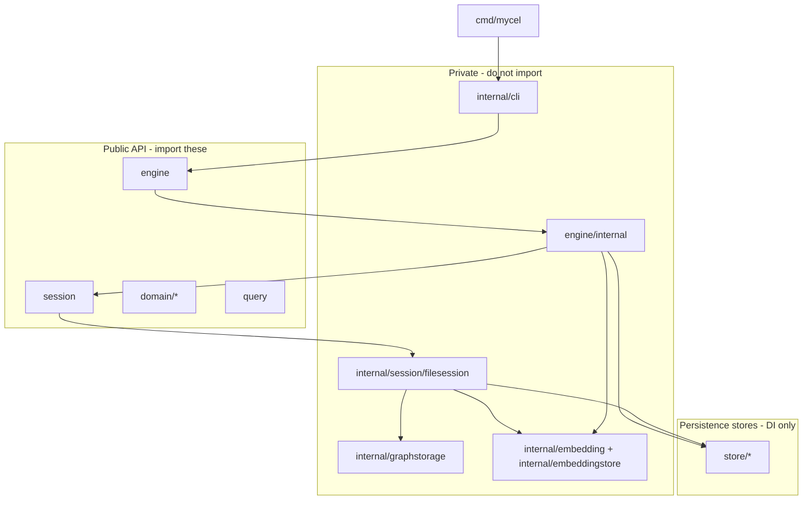
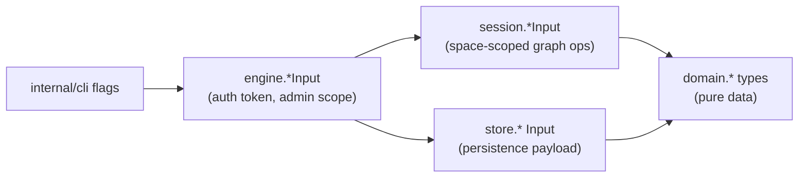

# MycelDB architecture

This document explains how the MycelDB module is organized, where to find types and interfaces, and how request payloads flow between layers.

## Layer overview



### Public vs internal packages

| Import | Purpose |
|--------|---------|
| `engine` | Engine lifecycle, auth, users, spaces, ACL, open session |
| `session` | Graph operations inside a space (nodes, edges, templates, queries) |
| `domain/identity`, `domain/space`, `domain/access`, `domain/graph`, `domain/embedding` | Pure data types |
| `query` | Programmatic graph query builder |
| `store/*` | Injectable persistence interfaces (for tests or custom backends) |
| `engine/internal`, `internal/*` | **Do not import** from applications |
| `cmd/mycel`, `internal/cli` | CLI binary only |

Typical MycelDB applications import only `engine`, `session`, and `domain/*`.

## Where to find things

| I need… | Look here |
|---------|-----------|
| **Engine method signature** | `engine/engine.go` → `Engine` interface |
| **Engine request types** (`CreateUserInput`, `OpenSessionInput`, …) | `engine/internal/types.go` (re-exported in `engine/engine.go`) |
| **Graph session method signature** | `session/api/types.go` → `Session` and `Tx` interfaces (re-exported from `session/session.go`) |
| **Session request types** (`AddNodeInput`, `ApplyGraphInput`, `TxOptions`, …) | `session/api/types.go` |
| **Pure data structs** (`User`, `Node`, `Space`, ACL rules, embedding records) | `domain/identity`, `domain/space`, `domain/access`, `domain/graph`, `domain/embedding` |
| **Store interfaces** (`Manager`) | `store/user`, `store/spaces`, `store/acl`, `store/template`, `store/embedding` → `interface.go` |
| **Store request types** (`CreateInput`, …) | Same `store/*/interface.go` files |
| **Default file-backed session impl** | `internal/session/filesession/` |
| **Low-level graph segment I/O** | `internal/graphstorage/types.go` |
| **Query builder** | `query/builder.go` |

## Import path conventions

Store packages use names that do not collide with `domain/*`:

| Store path | Package name | Domain counterpart |
|------------|--------------|-------------------|
| `store/user` | `user` | `domain/identity` |
| `store/spaces` | `spaces` | `domain/space` |
| `store/acl` | `acl` | `domain/access` |
| `store/template` | `template` | `domain/graph` (template types) |
| `store/embedding` | `embedding` | `domain/embedding` |

Recommended aliases when both domain and store appear in one file:

```go
import (
    domainaccess "github.com/myceldb/mycel/domain/access"
    domainspace "github.com/myceldb/mycel/domain/space"
    "github.com/myceldb/mycel/store/acl"
    "github.com/myceldb/mycel/store/spaces"
    storetemplate "github.com/myceldb/mycel/store/template"
)
```

## Input-type layering

Operations often have similar-looking structs at each layer. Each layer adds or removes fields for its responsibility:



### Example: create user

| Layer | Type | Extra fields |
|-------|------|--------------|
| CLI | flags `--ref`, `--new-password` | — |
| Engine | `engine.CreateUserInput` | `AccessToken`, password |
| Store | `user.CreateInput` | trimmed to persistence needs |
| Domain | `identity.UserInput` | `Ref`, optional `ID`, status |

### Example: add node

| Layer | Type | Notes |
|-------|------|-------|
| Engine | `engine.OpenSessionInput` | auth + space scope |
| Session | `session.AddNodeInput` | graph write payload |
| Domain | `graph.Node` | persisted result shape |

## Typical embedder call flow

```
engine.NewEngine(cfg, nil, nil, nil, nil)
  → Authenticate(ctx, AuthInput{...})
  → OpenSession(ctx, OpenSessionInput{AccessToken, SpaceID})
  → session.Tx(ctx, TxOptions{}, func(tx session.Tx) error { ... })
  → tx.AddNode(ctx, AddNodeInput{...})
  → domain/graph.Node
```

Downstream applications should follow this flow when embedding MycelDB directly.

## Interface placement

Interfaces are defined next to their primary consumer, not in a single global file:

| Interface | File |
|-----------|------|
| `engine.Engine` | `engine/engine.go` |
| `session.Session`, `session.Tx` | `session/api/types.go` |
| `store/user.Manager` | `store/user/interface.go` |
| `store/spaces.Manager` | `store/spaces/interface.go` |
| `store/acl.Manager` | `store/acl/interface.go` |
| `store/template.Manager` | `store/template/interface.go` |
| `store/embedding.Manager` | `store/embedding/interface.go` |
| `graphstorage.Store` | `internal/graphstorage/types.go` |
| `query.Executor` | `query/builder.go` |

## Directory map

```
mycel/
├── cmd/mycel/           CLI entrypoint
├── internal/
│   ├── cli/              CLI commands (private)
│   ├── session/filesession/  File-backed Session implementation
│   ├── graphstorage/     Segment graph persistence
│   ├── embedding/        Embedding catalog, source assembly, providers
│   ├── embeddingstore/   Space-scoped vector persistence/search
│   └── filestore/        Atomic file writes
├── engine/
│   ├── engine.go         Public Engine API
│   └── internal/         Default engine + engine DTOs
├── session/
│   ├── api/types.go        Session interface + request DTOs
│   └── session.go          Public re-exports + NewSession
├── domain/
│   ├── identity/         Users, UserID, Owner
│   ├── space/            Space, SpaceID, settings
│   ├── access/           Roles, permissions, ACL rules
│   ├── embedding/        Embedding catalog/profile/record/search types
│   └── graph/            Node, Edge, Template
├── store/
│   ├── user/             User/credential persistence
│   ├── spaces/           Space metadata persistence
│   ├── acl/              ACL persistence
│   ├── embedding/        Embedding keys/profile metadata persistence
│   └── template/         Template persistence
├── query/                Query builder
└── docs/                 Reference documentation
```

## Start here for common tasks

| Task | Start file |
|------|------------|
| Add a public engine method | `engine/engine.go`, then `engine/internal/` |
| Add a graph session or transaction method | `session/api/types.go`, then `internal/session/filesession/` |
| Add a domain type | appropriate `domain/*/` package |
| Change meta JSON persistence | `store/*/file_store.go` |
| Change graph file persistence | `internal/graphstorage/` |
| Add a CLI command | `internal/cli/cmd/` |
