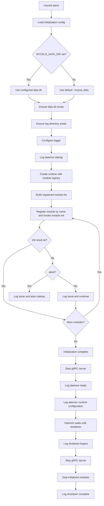
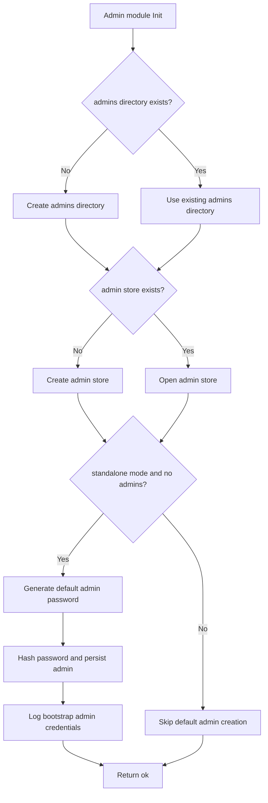

# Daemon Initialization

## Status

Draft v2 design note for the `refactor_daemon` branch.

This document describes the intended daemon initialization behavior for the current design scope only. It does not describe a complete daemon runtime beyond initialization, module registration, and the current admin/operator management slice.

## Scope

The current initialization design covers:

- daemon startup entrypoint
- configuration loading for initialization
- data directory creation
- log directory creation
- logger initialization
- admin management module initialization
- user management module initialization
- admin store creation when missing
- user store creation when missing
- default standalone admin creation when no admin store exists
- admin/operator list and lifecycle operations
- gRPC listener startup for Admin API operations
- startup/shutdown log messages

Out of scope for this document:

- client graph APIs
- admin user management
- admin operator role/capability mutation beyond the current daemon-local file store
- space management
- mesh networking
- replication
- gRPC listener setup details
- production credential rotation
- full daemon module lifecycle beyond init/admin operator management

## Terminology

This document uses **admin** to describe daemon administrator accounts and **operator** for the Admin API model of those accounts. The standalone bootstrap creates one initial active system-admin operator named `admin`.

## Initialization inputs

The daemon initialization phase uses a small environment/config surface.

Initial environment variables:

| Variable | Purpose |
| --- | --- |
| `MYCELD_DATA_DIR` | Root data directory for the daemon. Defaults to `~/mycel_data` when unset. |
| `MYCELD_MODE` | Daemon mode. Current relevant values: `standalone`, `mesh`. |
| `MYCELD_LOG_LEVEL` | Log level: `debug`, `info`, `warn`, or `error`. |
| `MYCELD_LOG_FORMAT` | Log format: `text` or `json`. |
| `MYCELD_GRPC_ADDR` | gRPC listener address. Defaults to `127.0.0.1:9091`. |

The environment variable list is expected to change as the daemon design evolves. This document only covers the variables needed by the current initialization design.

## Data directory layout

On startup, the daemon resolves `MYCELD_DATA_DIR`. If it is unset, the daemon defaults to:

```text
~/mycel_data
```

The daemon then ensures that the resolved data directory exists.

Within the data directory, the current initialization design creates the following structure when missing:

```text
<data>/
  log/
  admins/
  users/
    sessions/
```

`log/` stores daemon log files.

`admins/` stores daemon admin/operator management data for the current design scope.

`users/` stores daemon standard-user management data and user refresh-session records.

Additional directories will be introduced by future modules.

## Logging initialization

The daemon uses structured logging.

Initialization should ensure:

1. the data directory exists
2. the `log/` directory exists
3. logging is configured using the selected level and format
4. startup and shutdown events are recorded
5. filesystem initialization/reinitialization actions are recorded
6. admin initialization actions are recorded

Expected log events include:

- daemon startup begins
- data directory created or already exists
- log directory created or already exists
- admin directory created or already exists
- admin store created or already exists
- default standalone admin created, if applicable
- daemon initialization complete
- daemon ready
- daemon runtime configuration, including data directory, mode, gRPC address, log path, log level, and log format
- shutdown begins
- shutdown complete

When the default standalone admin is created, the generated username and password are logged so that an operator can retrieve them from the daemon log file. The log message must explicitly instruct the operator to change the generated password immediately.

The plaintext generated password is logged only for this bootstrap event and should not be stored as plaintext.

## Runtime composition

After resolving the data directory and configuring logging, initialization creates the daemon `Runtime` as the live daemon container.

The runtime owns:

- daemon config
- shared logger
- log path and close/cleanup hook
- initialized module registry

Modules are registered by name in a map:

```go
type Runtime struct {
    Config  config.Config
    Logger  *slog.Logger
    Modules map[string]Module
    LogPath string
}
```

The admin module is registered under:

```text
admin
```

The module map avoids hardcoded concrete module fields on the runtime while still making initialized modules discoverable by the daemon app, gRPC adapters, tests, and future module integrations.

## Module initialization contract

After resolving the data directory and configuring logging, the daemon invokes each registered module's `Init` method.

The top-level daemon runtime knows that modules exist, but it should not hardcode module internals. Module-specific filesystem layout, stores, and bootstrap behavior belong inside each module.

Conceptual module interface:

```go
type Module interface {
    Name() string
    Init(context.Context, *Runtime) InitResult
}
```

Conceptual initialization result:

```text
ok
```

or:

```text
error {
  module: string
  type: string
  message: string
  abort: bool
}
```

The `type` field is a string category, not an enum. Modules may define their own issue type strings. Recommended common strings include:

```text
filesystem
config
security
store
network
dependency
unknown
```

If `abort` is true, daemon startup stops. If `abort` is false, the daemon logs the issue and continues initializing remaining modules.

## Admin management module initialization

The current registered modules are the admin management module and the user management module.

Its `Init` method checks:

1. whether `<data>/admins/` exists
2. whether the admin store exists
3. whether standalone bootstrap behavior applies

If `<data>/admins/` does not exist, the module creates it.

If the admin store does not exist, the module creates it.

If the daemon is running in `standalone` mode and the admin store was missing or contains no admins, the module creates a default active system-admin operator:

```text
username: admin
password: randomly generated
```

The module persists the admin account with a password hash, active state, create/update timestamps, and a `system_admin` role grant. It does not store the plaintext password.

The module logs the generated username and plaintext password once for bootstrap access and explicitly tells the operator to change the generated password immediately.

If the admin store already exists and contains at least one admin, the module does not recreate the default admin. For compatibility with earlier daemon slices, standalone initialization also ensures at least one active existing admin has the `system_admin` role; if no active system admin exists, it grants `system_admin` to the first active existing admin and logs the migration.

## User management module initialization

The user module initializes:

```text
<data>/users/users.json
<data>/users/sessions/refresh_sessions.json
```

It stores daemon-managed standard users with active/disabled/deleted state, optional email/display name, create/update timestamps, and bcrypt password hashes. Password plaintext is never persisted.

The module also owns user refresh-session listing and revocation for AdminUserService.

## Admins/operators operations

The current admin management behavior includes daemon-local operator lifecycle operations.

Internally, the admin module exposes safe `AdminSummary` values that omit password hashes. Externally, authenticated clients access those summaries through:

```text
mycel.admin.v1.AdminAuthService.LoginOperator
mycel.admin.v1.AdminOperatorService
```

`LoginOperator` verifies an operator username/password and returns a short-lived bearer token. `AdminOperatorService` methods require that token in gRPC metadata. The current service supports list/get/find/create/update/disable/enable/soft-delete/password/role/capability/session RPCs backed by the daemon-local file store.

Only active operators can log in. Mutations that affect other operators require operator-management capability. The module rejects actions that would remove the last active system admin. Operator session RPCs are currently empty/no-op placeholders because operator access tokens are short-lived and not persisted.

## Standard user operations

Authenticated operators with `CAPABILITY_USER_CREATE` / `CAPABILITY_USER_MANAGE` can call:

```text
mycel.admin.v1.AdminUserService
```

The current service supports list/get/find/create/update/disable/enable/soft-delete/password/session RPCs backed by the daemon user module.

## Initialization sequence



The current admin management module's `Init` method internally follows this narrower flow:



## Idempotency

Initialization should be safe to run repeatedly.

Expected behavior on repeated startup:

- existing directories are reused
- existing admin store is reused
- default admin is not recreated if admins already exist
- initialization logs indicate that existing resources were found

## Security notes

- The generated default admin password is only for first standalone bootstrap.
- The generated password is logged once so the operator can retrieve it.
- The generated password must not be persisted as plaintext.
- Admin store files should be written with restrictive permissions.
- Log files may contain the one-time bootstrap password and should be protected accordingly.

## Testing expectations

Unit tests for the initialization design should cover:

- unset `MYCELD_DATA_DIR` defaults to `~/mycel_data`
- missing data directory is created
- missing log directory is created
- missing admins directory is created
- missing admin store is created
- standalone initialization creates default `admin` when no admins exist
- generated admin password is logged during bootstrap
- bootstrap log includes an explicit change-password warning
- plaintext password is not stored in the admin store
- repeated initialization does not recreate default admin
- list admins returns safe summaries without password hashes
- gRPC `LoginOperator` authenticates the bootstrap admin with the logged one-time password
- unauthenticated gRPC `ListOperators` fails
- authenticated gRPC `ListOperators` maps admin summaries to operator records
- daemon ready is followed by a runtime-configuration log entry with data directory, mode, gRPC address, log path, log level, and log format
- non-standalone mode does not create the default admin unless explicitly designed later
- runtime registers initialized modules by name
- module init errors include message, string type, and abort/continue behavior

## Current limitations

This document intentionally does not define:

- gRPC server startup
- CLI command syntax
- admin login flow
- admin password rotation
- admin disable/delete operations
- admin role/capability mutation
- mesh bootstrap

Those items are separate design/implementation topics.
