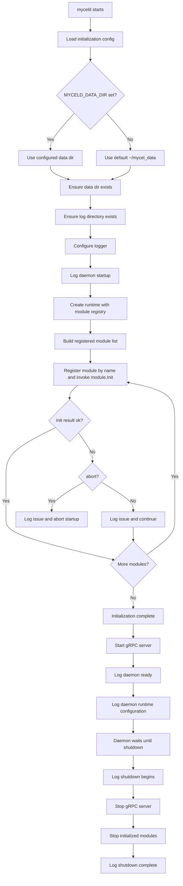
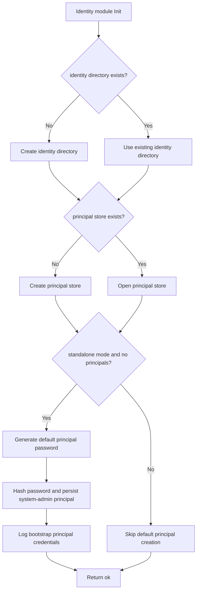

# Daemon Initialization

## Status

Current design note for daemon initialization.

This document describes the intended daemon initialization behavior for the current design scope only. It does not describe a complete daemon runtime beyond initialization, module registration, and the current unified principal identity slice.

## Scope

The current initialization design covers:

- daemon startup entrypoint
- configuration loading for initialization
- data directory creation
- log directory creation
- logger initialization
- identity subsystem initialization
- principal store creation when missing
- auth-session store creation when missing
- default standalone admin principal creation when no principal store exists
- principal list and lifecycle operations
- gRPC listener startup for Admin API operations
- startup/shutdown log messages

Out of scope for this document:

- client graph APIs
- product-level signup/profile management
- role/capability mutation beyond the current daemon-local principal store
- space management
- mesh networking
- replication
- gRPC listener setup details
- production credential rotation
- full daemon module lifecycle beyond init/principal management

## Terminology

This document uses **principal** for daemon-managed identities. A principal with system-management roles/capabilities can administer the daemon. The standalone bootstrap creates one initial active system-admin principal named `admin`.

## Initialization inputs

The daemon initialization phase uses a small environment/config surface.

Initial environment variables:

| Variable | Purpose |
| --- | --- |
| `MYCELD_DATA_DIR` | Root data directory for the daemon. Defaults to `~/mycel_data` when unset. |
| `MYCELD_MODE` | Daemon mode. Current relevant values: `standalone`, `mesh`. |
| `MYCELD_LOG_LEVEL` | Log level: `debug`, `info`, `warn`, or `error`. |
| `MYCELD_LOG_FORMAT` | Log format: `text` or `json`. |
| `MYCELD_GRPC_ADDR` | gRPC listener address. Defaults to `127.0.0.1:9091`. |

The environment variable list is expected to change as the daemon design evolves. This document only covers the variables needed by the current initialization design.

## Data directory layout

On startup, the daemon resolves `MYCELD_DATA_DIR`. If it is unset, the daemon defaults to:

```text
~/mycel_data
```

The daemon then ensures that the resolved data directory exists.

Within the data directory, the current initialization design creates the following structure when missing:

```text
<data>/
  log/
  identity/
    sessions/
```

`log/` stores daemon log files.

`identity/` stores unified principal records, role bindings, capability grants, and durable auth-session records.

Additional directories will be introduced by future modules.

## Logging initialization

The daemon uses structured logging.

Initialization should ensure:

1. the data directory exists
2. the `log/` directory exists
3. logging is configured using the selected level and format
4. startup and shutdown events are recorded
5. filesystem initialization/reinitialization actions are recorded
6. identity initialization actions are recorded

Expected log events include:

- daemon startup begins
- data directory created or already exists
- log directory created or already exists
- identity directory created or already exists
- principal store created or already exists
- default standalone admin principal created, if applicable
- daemon initialization complete
- daemon ready
- daemon runtime configuration, including data directory, mode, gRPC address, log path, log level, and log format
- shutdown begins
- shutdown complete

When the default standalone admin principal is created, the generated username and password are logged so that the deployment operator can retrieve them from the daemon log file. The log message must explicitly instruct the operator to change the generated password immediately.

The plaintext generated password is logged only for this bootstrap event and should not be stored as plaintext.

## Runtime composition

After resolving the data directory and configuring logging, initialization creates the daemon `Runtime` as the live daemon container.

The runtime owns:

- daemon config
- shared logger
- log path and close/cleanup hook
- initialized module registry

Modules are registered by name in a map:

```go
type Runtime struct {
    Config  config.Config
    Logger  *slog.Logger
    Modules map[string]Module
    LogPath string
}
```

The admin module is registered under:

```text
admin
```

The module map avoids hardcoded concrete module fields on the runtime while still making initialized modules discoverable by the daemon app, gRPC adapters, tests, and future module integrations.

## Module initialization contract

After resolving the data directory and configuring logging, the daemon invokes each registered module's `Init` method.

The top-level daemon runtime knows that modules exist, but it should not hardcode module internals. Module-specific filesystem layout, stores, and bootstrap behavior belong inside each module.

Conceptual module interface:

```go
type Module interface {
    Name() string
    Init(context.Context, *Runtime) InitResult
}
```

Conceptual initialization result:

```text
ok
```

or:

```text
error {
  module: string
  type: string
  message: string
  abort: bool
}
```

The `type` field is a string category, not an enum. Modules may define their own issue type strings. Recommended common strings include:

```text
filesystem
config
security
store
network
dependency
unknown
```

If `abort` is true, daemon startup stops. If `abort` is false, the daemon logs the issue and continues initializing remaining modules.

## Identity module initialization

The identity subsystem initializes the unified principal store and durable auth-session store:

```text
<data>/identity/store.json
<data>/identity/sessions/refresh_sessions.json
```

It stores daemon-managed principals with active/disabled/deleted state, create/update timestamps, role bindings, capability grants, and password hashes when login is enabled. Password plaintext is never persisted.

If the daemon is running in `standalone` mode and the principal store is empty, initialization creates a default active system-admin principal:

```text
username: admin
password: randomly generated
```

The module logs the generated username and plaintext password once for bootstrap access and explicitly tells the operator to change the generated password immediately.

The identity subsystem enforces the last-system-admin invariant: mutations must not remove or disable the final active principal with system-admin authority.

## Principal operations

The current admin identity behavior includes daemon-local principal lifecycle operations. Authenticated clients access those operations through:

```text
mycel.common.v1.AuthService
mycel.admin.v1.AdminPrincipalService
```

`AuthService.Login` verifies principal username/password and returns a short-lived bearer token plus refresh-session metadata. `AdminPrincipalService` methods require a bearer token whose principal has the relevant role/capability. The current service supports list/get/find/create/update/disable/enable/delete/password/role/capability/session RPCs backed by the unified principal store.

## Initialization sequence



The identity subsystem's `Init` method internally follows this narrower flow:



## Idempotency

Initialization should be safe to run repeatedly.

Expected behavior on repeated startup:

- existing directories are reused
- existing principal store is reused
- default admin principal is not recreated if principals already exist
- initialization logs indicate that existing resources were found

## Security notes

- The generated default admin password is only for first standalone bootstrap.
- The generated password is logged once so the operator can retrieve it.
- The generated password must not be persisted as plaintext.
- Identity store files should be written with restrictive permissions.
- Log files may contain the one-time bootstrap password and should be protected accordingly.

## Testing expectations

Unit tests for the initialization design should cover:

- unset `MYCELD_DATA_DIR` defaults to `~/mycel_data`
- missing data directory is created
- missing log directory is created
- missing identity directory is created
- missing principal store is created
- standalone initialization creates default `admin` when no principals exist
- generated principal password is logged during bootstrap
- bootstrap log includes an explicit change-password warning
- plaintext password is not stored in the identity store
- repeated initialization does not recreate default admin principal
- list principals returns safe summaries without password hashes
- gRPC `AuthService.Login` authenticates the bootstrap admin principal with the logged one-time password
- unauthenticated gRPC `ListPrincipals` fails
- authenticated gRPC `ListPrincipals` returns principal records
- daemon ready is followed by a runtime-configuration log entry with data directory, mode, gRPC address, log path, log level, and log format
- non-standalone mode does not create the default admin unless explicitly designed later
- runtime registers initialized modules by name
- module init errors include message, string type, and abort/continue behavior

## Current limitations

This document intentionally does not define:

- gRPC server startup
- CLI command syntax
- auth login flow
- principal password rotation
- principal disable/delete operations
- principal role/capability mutation
- mesh bootstrap

Those items are separate design/implementation topics.
