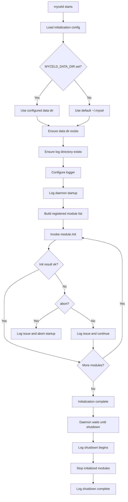
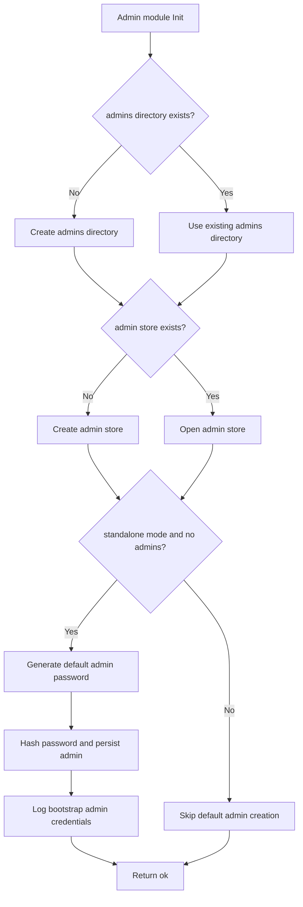

# Daemon Initialization

## Status

Draft v2 design note for the `refactor_daemon` branch.

This document describes the intended daemon initialization behavior for the current design scope only. It does not describe a complete daemon runtime and does not introduce additional functionality beyond initialization and listing admins/operators.

## Scope

The current initialization design covers:

- daemon startup entrypoint
- configuration loading for initialization
- data directory creation
- log directory creation
- logger initialization
- admin management module initialization
- admin store creation when missing
- default standalone admin creation when no admin store exists
- list admins operation
- startup/shutdown log messages

Out of scope for this document:

- client graph APIs
- admin user management
- admin operator role mutation
- space management
- mesh networking
- replication
- gRPC listener setup details
- production credential rotation
- full daemon module lifecycle beyond init/list admins

## Terminology

This document uses **admin** to describe the initial daemon administrator account created during standalone initialization.

The v2 Admin API design also uses the term **operator** for system admins/operators. The implementation may align naming later, but the narrow initialization behavior described here is simply: create and list daemon admins.

## Initialization inputs

The daemon initialization phase uses a small environment/config surface.

Initial environment variables:

| Variable | Purpose |
| --- | --- |
| `MYCELD_DATA_DIR` | Root data directory for the daemon. Defaults to `~/.mycel` when unset. |
| `MYCELD_MODE` | Daemon mode. Current relevant values: `standalone`, `mesh`. |
| `MYCELD_LOG_LEVEL` | Log level: `debug`, `info`, `warn`, or `error`. |
| `MYCELD_LOG_FORMAT` | Log format: `text` or `json`. |

The environment variable list is expected to change as the daemon design evolves. This document only covers the variables needed by the current initialization design.

## Data directory layout

On startup, the daemon resolves `MYCELD_DATA_DIR`. If it is unset, the daemon defaults to:

```text
~/.mycel
```

The daemon then ensures that the resolved data directory exists.

Within the data directory, the current initialization design creates the following structure when missing:

```text
<data>/
  log/
  admins/
```

`log/` stores daemon log files.

`admins/` stores daemon admin/operator management data for the current design scope.

Additional directories will be introduced by future modules, but they are not part of this document's current behavior.

## Logging initialization

The daemon uses structured logging.

Initialization should ensure:

1. the data directory exists
2. the `log/` directory exists
3. logging is configured using the selected level and format
4. startup and shutdown events are recorded
5. filesystem initialization/reinitialization actions are recorded
6. admin initialization actions are recorded

Expected log events include:

- daemon startup begins
- data directory created or already exists
- log directory created or already exists
- admin directory created or already exists
- admin store created or already exists
- default standalone admin created, if applicable
- daemon initialization complete
- shutdown begins
- shutdown complete

When the default standalone admin is created, the generated username and password are logged so that an operator can retrieve them from the daemon log file.

The plaintext generated password is logged only for this bootstrap event and should not be stored as plaintext.

## Module initialization contract

After resolving the data directory and configuring logging, the daemon invokes each registered module's `Init` method.

The top-level daemon runtime knows that modules exist, but it should not hardcode module internals. Module-specific filesystem layout, stores, and bootstrap behavior belong inside each module.

Conceptual module interface:

```go
type Module interface {
    Name() string
    Init(context.Context, *Runtime) InitResult
}
```

Conceptual initialization result:

```text
ok
```

or:

```text
error {
  module: string
  type: string
  message: string
  abort: bool
}
```

The `type` field is a string category, not an enum. Modules may define their own issue type strings. Recommended common strings include:

```text
filesystem
config
security
store
network
dependency
unknown
```

If `abort` is true, daemon startup stops. If `abort` is false, the daemon logs the issue and continues initializing remaining modules.

## Admin management module initialization

The current registered module is the admin management module.

Its `Init` method checks:

1. whether `<data>/admins/` exists
2. whether the admin store exists
3. whether standalone bootstrap behavior applies

If `<data>/admins/` does not exist, the module creates it.

If the admin store does not exist, the module creates it.

If the daemon is running in `standalone` mode and the admin store was missing or contains no admins, the module creates a default admin account:

```text
username: admin
password: randomly generated
```

The module persists the admin account with a password hash, not the plaintext password.

The module logs the generated username and plaintext password once for bootstrap access.

If the admin store already exists and contains at least one admin, the module does not recreate the default admin.

## List admins operation

The current admin management behavior includes a list admins operation.

The operation returns the known admins from the admin store.

The list operation is read-only and does not create, update, disable, delete, or grant privileges.

The current design does not define additional admin operations in this initialization document.

Future Admin API documents may define richer operator/admin lifecycle operations separately.

## Initialization sequence



The current admin management module's `Init` method internally follows this narrower flow:



## Idempotency

Initialization should be safe to run repeatedly.

Expected behavior on repeated startup:

- existing directories are reused
- existing admin store is reused
- default admin is not recreated if admins already exist
- initialization logs indicate that existing resources were found

## Security notes

- The generated default admin password is only for first standalone bootstrap.
- The generated password is logged once so the operator can retrieve it.
- The generated password must not be persisted as plaintext.
- Admin store files should be written with restrictive permissions.
- Log files may contain the one-time bootstrap password and should be protected accordingly.

## Testing expectations

Unit tests for the initialization design should cover:

- unset `MYCELD_DATA_DIR` defaults to `~/.mycel`
- missing data directory is created
- missing log directory is created
- missing admins directory is created
- missing admin store is created
- standalone initialization creates default `admin` when no admins exist
- generated admin password is logged during bootstrap
- plaintext password is not stored in the admin store
- repeated initialization does not recreate default admin
- list admins returns the persisted admin records
- non-standalone mode does not create the default admin unless explicitly designed later
- module init errors include message, string type, and abort/continue behavior

## Current limitations

This document intentionally does not define:

- gRPC server startup
- CLI command syntax
- admin login flow
- admin password rotation
- admin disable/delete operations
- admin role/capability mutation
- mesh bootstrap

Those items are separate design/implementation topics.
